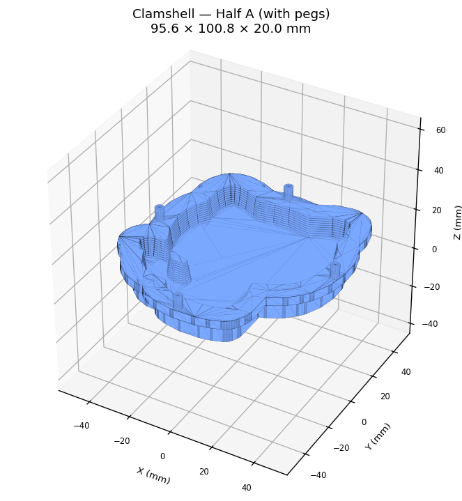
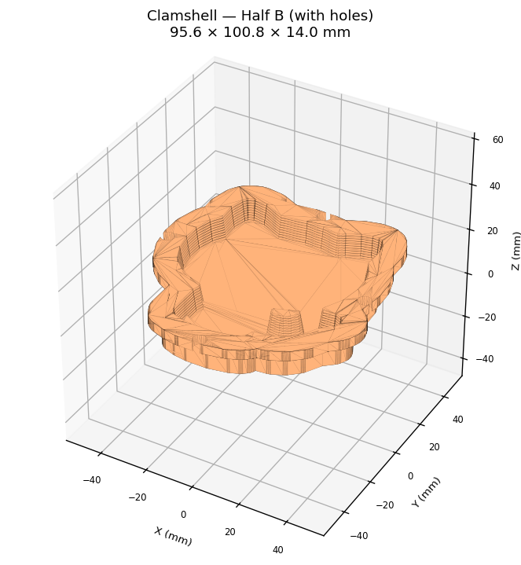
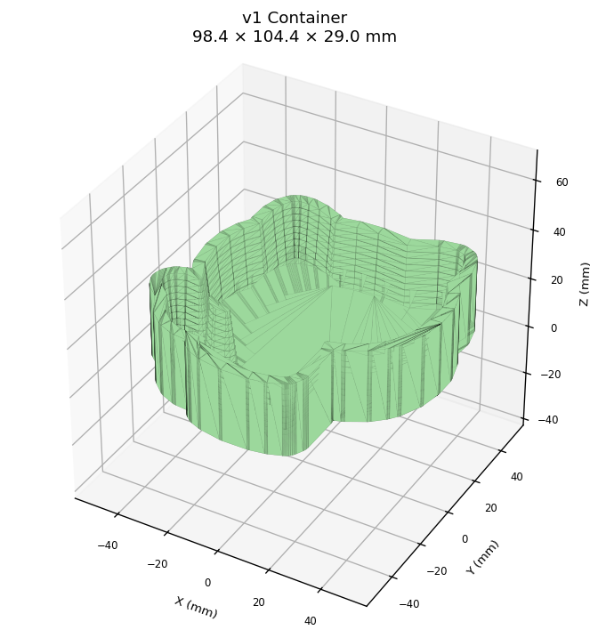
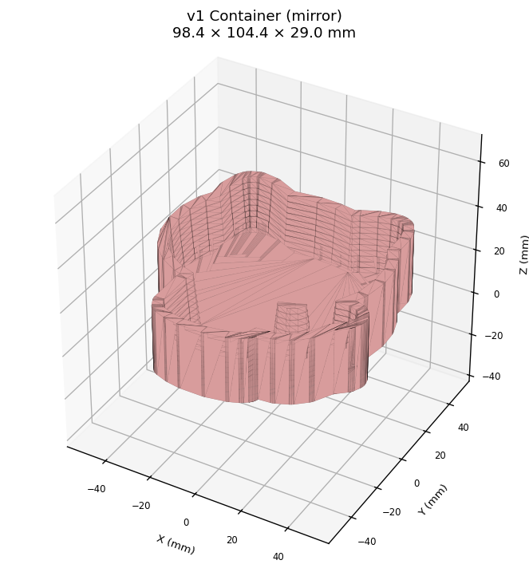

# 🛁🐱 copilot-cli-bathbomb-experiment

**[日本語](#日本語) | [English](#english)**

---

<a id="日本語"></a>
## 日本語

🧪 GitHub Copilot CLIで画像からバスボム用3Dプリント型（モールド）を自動生成する実験記録

### 概要

GitHub のロゴ（Octocat）の画像から、猫型バスボム用の3Dプリント型を自動生成します。
2分割のクラムシェル（貝殻型）構造で、乾燥後に左右にパカッと開いてバスボムを取り出せます。

### 生成される型

猫シルエットの **クラムシェル2分割型**（左右ハーフ：A・B）

- 左右ハーフが鏡像でパーティングプレーン上で合わさる
- 抜き勾配 **8°**（v1の5°から増、粉末材料での離型性を改善）
- フィレット R3mm（角を丸めてひび割れ防止）
- 壁厚 4mm・床厚 4mm
- 外周フランジ 5mm 幅（ゴムバンドで圧着するためのリム）
- φ4mm 位置決めピン × 4 本（ハーフAにピン、ハーフBに穴）
- 目標サイズ：おおむね 80×80×20mm の手のひらサイズバスボム

### 過去の試作（参考）

第1回試作の片面コンテナ型 (`mold_cat_container.stl` / `mold_cat_container_mirrored.stl`) は履歴として残しています。失敗の経緯は [`experiments/2026-05-04-trial-01/`](experiments/2026-05-04-trial-01/) を参照。

### 🎉 成功事例（Trial 02）

第2回試作で **4色のOctocat バスボム作りに成功** しました 🐱✨
GitHub を退職する同僚（元 Microsoft 社員）への餞別ギフトとして、Microsoft ロゴカラー（赤・緑・青・黄）の 4 色 Octocat バスボムを製作し、**Lush で買った期間限定の「マリオはてなブロック」型ギフトボックス**に詰めて贈りました（ついでに同店で「ヨッシーの卵」バスボム＋泡ボムも購入し、保険として同梱）。

ちなみに今回は v2 自動生成クラムシェルを **使わず**、v1 のコンテナ型を **Bambu Studio で左右 2 分割** にカットして印刷した workaround で離型問題を解決しています。

| 離型成功 | 4 色セット完成 |
|---|---|
|  |  |

詳しい製作工程・レシピ・写真・動画・学びは [`experiments/2026-05-06-trial-02/`](experiments/2026-05-06-trial-02/) を参照。

> 📘 **離型ガイド (GitHub Pages)**: 完成したバスボムを型から崩さずに取り出すコツを
> Codelab 形式でまとめています →
> **<https://ktanino10.github.io/copilot-cli-bathbomb-experiment/>**
> （8 ステップ・約 14 分。NG 動作／推奨手順／"そもそも完全に外さない" 運用 ほか）
> 🌐 **日本語 / English** 両対応 — 右上のセレクターで切り替え可
> ([🇯🇵 JA](https://ktanino10.github.io/copilot-cli-bathbomb-experiment/?version=v1.0.0&lang=ja) ·
>  [🇬🇧 EN](https://ktanino10.github.io/copilot-cli-bathbomb-experiment/?version=v1.0.0&lang=en))

### 使い方

```bash
# 依存ライブラリのインストール
pip install pillow numpy scipy scikit-image shapely trimesh manifold3d

# STLファイル生成
python generate_mold.py
```

### 出力ファイル

```
mold_cat_clamshell_A.stl  — クラムシェル ハーフA（位置決めピン付き）
mold_cat_clamshell_B.stl  — クラムシェル ハーフB（ピン穴付き）
```

両方を1部ずつプリントして1セットになります。

### 📸 STL プレビュー

> ⚠️ **GitHub の STL 3D ビューアが「Unable to render code block」と表示されることがあります。**
> 形を確認するための静的プレビュー画像を `previews/` に同梱しています。
> 詳細にスクスクと回したい場合は、STL を [Raw でダウンロード](https://raw.githubusercontent.com/ktanino10/copilot-cli-bathbomb-experiment/main/mold_cat_clamshell_A.stl) して
> [ViewSTL](https://www.viewstl.com/) などのオンラインビューアで開くか、Bambu Studio などローカルツールでご覧ください。

| クラムシェル A（v2、ピン付き） | クラムシェル B（v2、穴付き） |
|---|---|
|  |  |

| v1 コンテナ型（参考） | v1 コンテナ型・ミラー（参考） |
|---|---|
|  |  |

これらの PNG は `python generate_previews.py` で再生成できます（trimesh + matplotlib）。

### 3Dプリント推奨設定

| パラメータ | 設定値 |
|-----------|--------|
| プリンター | FDM |
| フィラメント | PLA |
| レイヤー高さ | 0.2mm |
| インフィル | 20〜30% |
| サポート | なし |
| ブリム | あり（反り防止） |

印刷後はキャビティ内面をサンドペーパー（#400→#800）で研磨し、使用時は食品用ラップを敷いてください。

### 型の設計仕様

| 項目 | 値 |
|------|-----|
| 構造 | クラムシェル2分割（左右ハーフ） |
| キャビティ深さ | 10mm × 2（合計約20mm） |
| 猫シルエット幅 | 約80mm |
| 壁厚 | 4mm |
| 床厚 | 4mm |
| 抜き勾配 | 8° |
| フィレット | R3mm |
| フランジ幅 / 厚さ | 5mm / 4mm |
| 位置決めピン | φ4mm × 4本（A：ピン／B：穴） |

### 制作ガイド

📖 **[GUIDE.md](GUIDE.md)** — 買い出しリスト・全手順・トラブルシューティング（日本語）

📖 **[GUIDE_EN.md](GUIDE_EN.md)** — Full guide in English

### ツール

- [GitHub Copilot CLI](https://githubnext.com/projects/copilot-cli/)
- Python 3 + trimesh + manifold3d（3Dブーリアン演算）
- scikit-image + shapely（画像→ポリゴン変換）

---

<a id="english"></a>
## English

🧪 Experiment: Auto-generating 3D-printable bath bomb molds from images with GitHub Copilot CLI

### Overview

Automatically generates a 3D-printable bath bomb mold in the shape of the GitHub Octocat,
designed as a **two-piece clamshell** so the finished bath bomb pops out cleanly when the
two halves are unclipped after drying.

### Generated Mold

Two-piece **clamshell** mold (halves A and B):

- Mirrored halves meeting on a flat parting plane
- **8° draft angle** (steeper than v1's 5° — much easier release for powdery material)
- R3mm fillets on the cat silhouette (prevents cracking)
- 4mm walls and 4mm floor on each half
- 5mm outer flange around the parting plane (for rubber-band clamping)
- 4 × φ4mm alignment dowels (pegs on side A, matching holes on side B)
- Target bath bomb size ≈ 80×80×20mm — fits in one hand

### Previous Trial (kept for reference)

The original single-sided container mold (`mold_cat_container.stl` /
`mold_cat_container_mirrored.stl`) is kept in the repo as historical artifact.
See [`experiments/2026-05-04-trial-01/`](experiments/2026-05-04-trial-01/) for what went wrong.

### 🎉 Success Story (Trial 02)

The second trial **produced four Octocat bath bombs successfully** 🐱✨
They were made as a farewell gift for a colleague leaving GitHub (formerly at Microsoft) — cast in
the **Microsoft logo colors (red, green, blue, yellow)** and packed into a
**Mario "question-block" gift box bought at Lush as a limited-edition item**
(a Lush "Yoshi's Egg" bath bomb and a foam bomb were picked up at the same store
and included as backup gifts).

Note that this batch did **not** use the v2 auto-generated clamshell; instead the v1 container
mold was **split left/right in Bambu Studio's slicer** before printing — a workaround that
solved the demolding problem with no model redesign.

| Clean release | Four-color set |
|---|---|
|  |  |

See [`experiments/2026-05-06-trial-02/`](experiments/2026-05-06-trial-02/) for the full
process, recipe, photos, video and lessons learned.

> 📘 **Demolding Guide (GitHub Pages)**: a Codelab-style walkthrough of how to
> safely release the finished bath bomb from its mold →
> **<https://ktanino10.github.io/copilot-cli-bathbomb-experiment/>**
> (8 steps · ~14 min · do's and don'ts, the recommended one-half release,
> and the "don't fully demold at all" gifting pattern).
> 🌐 **Available in 日本語 / English** — toggle in the top-right
> ([🇬🇧 EN](https://ktanino10.github.io/copilot-cli-bathbomb-experiment/?version=v1.0.0&lang=en) ·
>  [🇯🇵 JA](https://ktanino10.github.io/copilot-cli-bathbomb-experiment/?version=v1.0.0&lang=ja))

### Usage

```bash
# Install dependencies
pip install pillow numpy scipy scikit-image shapely trimesh manifold3d

# Generate STL
python generate_mold.py
```

### Output

```
mold_cat_clamshell_A.stl  — Clamshell half A (with alignment pegs)
mold_cat_clamshell_B.stl  — Clamshell half B (with matching holes)
```

Print one of each to make a complete set.

### 📸 STL Previews

> ⚠️ **GitHub's inline STL 3D viewer sometimes shows "Unable to render code block".**
> Static PNG previews are included in `previews/` so you can see the geometry
> without the viewer. For an interactive look, download the raw STL and open it
> in [ViewSTL](https://www.viewstl.com/) or a local tool like Bambu Studio /
> PrusaSlicer / MeshLab.

| Clamshell A (v2, with pegs) | Clamshell B (v2, with holes) |
|---|---|
|  |  |

| v1 container (reference) | v1 container, mirrored (reference) |
|---|---|
|  |  |

These PNGs are regenerated by `python generate_previews.py` (trimesh + matplotlib).

### Recommended Print Settings

| Parameter | Value |
|-----------|-------|
| Printer | FDM |
| Filament | PLA |
| Layer height | 0.2mm |
| Infill | 20–30% |
| Support | None |
| Brim | Yes (prevents warping) |

Sand the cavity interior (#400 → #800 grit) after printing. Line with plastic wrap before use.

### Mold Specs

| Spec | Value |
|------|-------|
| Structure | Two-piece clamshell (halves A + B) |
| Cavity depth | 10mm × 2 (≈20mm total bath bomb) |
| Cat silhouette width | ≈80mm |
| Wall thickness | 4mm |
| Floor thickness | 4mm |
| Draft angle | 8° |
| Fillet radius | R3mm |
| Flange width / thickness | 5mm / 4mm |
| Alignment dowels | 4 × φ4mm (pegs on A, holes on B) |

### Crafting Guide

📖 **[GUIDE.md](GUIDE.md)** — Full guide in Japanese (日本語)

📖 **[GUIDE_EN.md](GUIDE_EN.md)** — Shopping list, step-by-step instructions & troubleshooting

### Tools

- [GitHub Copilot CLI](https://githubnext.com/projects/copilot-cli/)
- Python 3 + trimesh + manifold3d (3D boolean operations)
- scikit-image + shapely (image → polygon conversion)

## License

MIT
