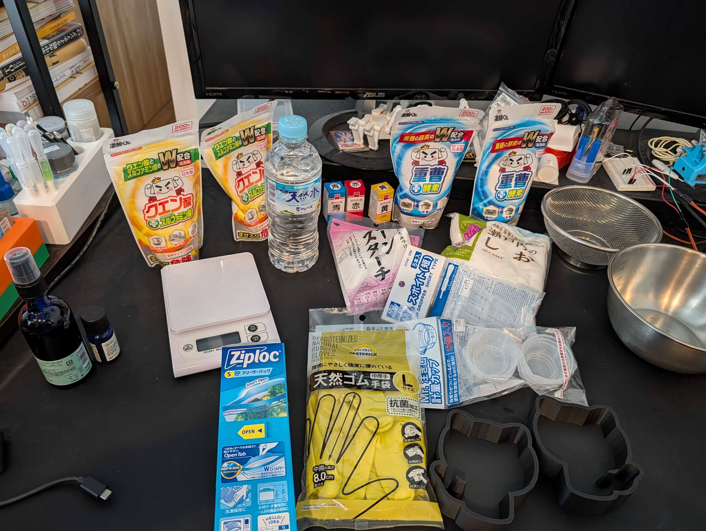
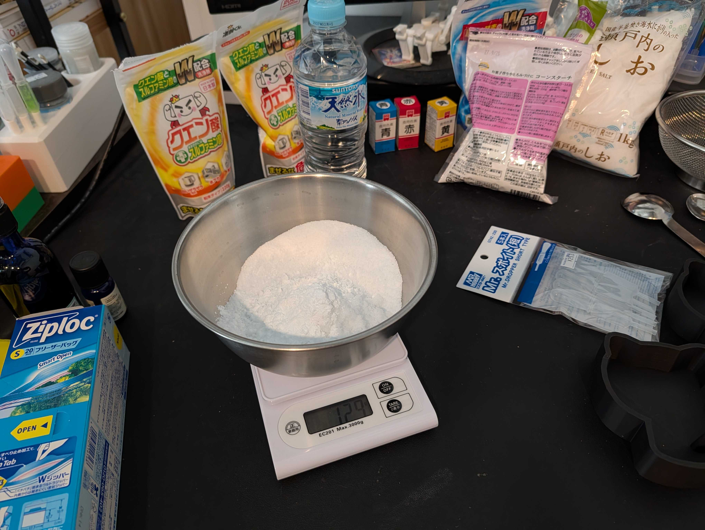
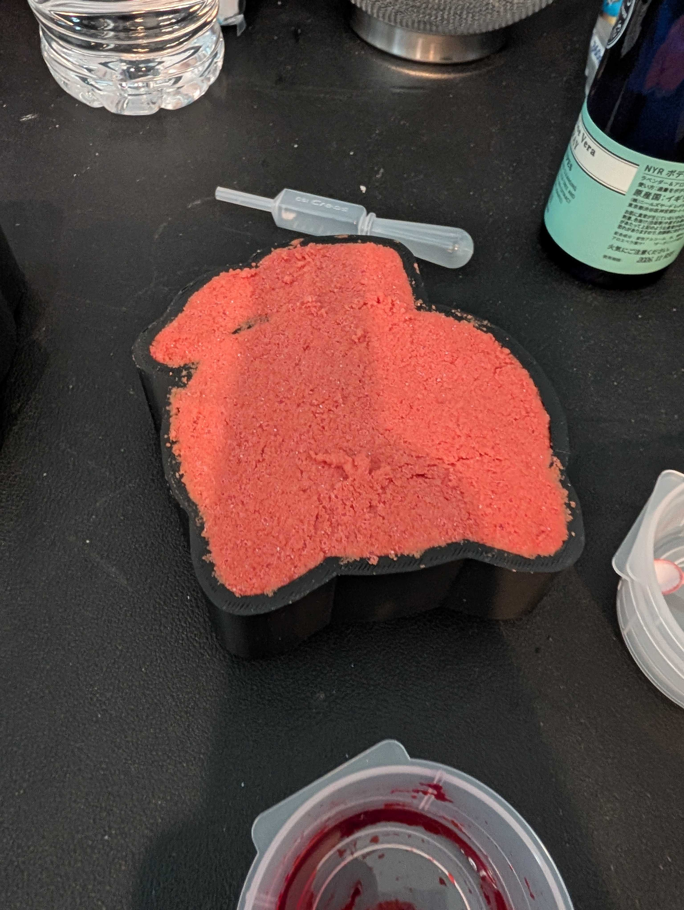

# 🧪 Trial 01 — 2026-05-04（失敗）

第1回試作の記録。**バスボムが型から取り出せず失敗**。型のデザインを根本から見直すきっかけとなった試行。

---

## 使用した型

| 項目 | 値 |
|------|----|
| STLファイル | [`mold_cat_container.stl`](../../mold_cat_container.stl) |
| 型方式 | 片面コンテナ型（床密閉・上面開口） |
| キャビティ深さ | 25mm |
| 抜き勾配 | 5° |
| 壁厚 / 床厚 | 4mm / 4mm |
| フィレット | R3mm |
| プリント材料 | PLA |

## 制作手順（実施したもの）

1. 重曹・クエン酸・コーンスターチを計量・混合
2. 食用色素（赤）で着色
3. 無水エタノールで湿度調整
4. 型に詰めて上面を平らにならす
5. 数時間〜半日乾燥させた後、型から外そうとした

## 失敗の状況

- 型をひっくり返しても、押しても、バスボムが**全く外れなかった**
- ラップを敷かずに直接詰めたため、型内壁との密着が強かった可能性あり
- 上面（型から見える面）はそれなりに綺麗に固まっていた

📷 失敗時の写真:

| 段階 | 画像 |
|------|------|
| 材料準備 |  |
| 粉末混合中 |  |
| 型から外せず詰まったまま |  |

## 失敗の根本原因（分析）

| # | 原因 | 説明 |
|---|------|------|
| 1 | **床密閉のコンテナ構造** | 底から押し出す手段がなく、ひっくり返して落とすしかない構造 |
| 2 | **抜き勾配5°が浅い** | 粉末・もろい材料には10°前後が必要。FDMの層間スジによる摩擦も加味されていなかった |
| 3 | **複雑なシルエット** | 猫の耳・触手の凹凸が多く、ラップを綺麗に敷くのが現実的に困難 |
| 4 | **離型剤・ラップ未使用** | 直接詰めたため内壁との密着が強かった |

## 次回への改善方針

→ 型を **クラムシェル2分割型** に再設計する（[../../README.md](../../README.md) 参照）。

主なポイント:
- 左右対称の半身がパーティングプレーンで合わさる構造に変更
- 抜き勾配を 5° → 8° に拡大
- 周囲フランジ + 位置決めピンで自己整合
- 取り出しは「パカッと開ける」だけ
