# 🎉 Trial 02 — 2026-05-06（成功）

**[日本語](#日本語) | [English](#english)**

---

<a id="日本語"></a>
## 日本語

第2回試作の記録。**4色のOctocatバスボム作りに成功** 🐱✨

[第1回 (失敗)](../2026-05-04-trial-01/) で得た学びを反映しつつ、**実際は別アプローチ**で離型問題を解決しました（後述）。

> 📌 **ただし注意**: 離型自体は成功したものの、Octocat の細い耳・触手部分が脆く、
> 人に手渡す際の振動・衝撃で崩れやすいことが判明。最終的なギフトは
> **「型に詰めたまま」渡す方針に変更**しました。受取人がクラムシェルを開けて、
> バスボムをそのままお湯に投入する形に。3D プリント型もギフトの一部です 🎁

---

### 背景ストーリー 🎁

GitHub を退職する同僚（**元 Microsoft 社員**）への餞別ギフトとして製作。
Octocat の形をした **Microsoft ロゴカラー（赤・緑・青・黄）** の 4 色バスボムを作り、
マリオの「はてなブロック」風の 3D プリント箱に詰めて贈ることに。

> 💡 万が一手作りバスボムが失敗しても恥をかかないよう、保険として
> Lush の「ヨッシーの卵」バスボムと泡ボムも 1 個ずつ同梱。
> 結果として手作りも成功したので、両方贈ることになりました。

---

### 使用した型 — 設計と現実

このリポジトリには 2 種類の型 STL があります:

| 型 | ファイル | 状態 |
|---|---|---|
| v1: 片面コンテナ型 | [`mold_cat_container.stl`](../../mold_cat_container.stl) | trial-01 で失敗 |
| v2: 自動生成クラムシェル型（上下分割） | [`mold_cat_clamshell_A.stl`](../../mold_cat_clamshell_A.stl) / [`mold_cat_clamshell_B.stl`](../../mold_cat_clamshell_B.stl) | trial-02 時点では未印刷 |

trial-02 では、設計し直した v2 クラムシェルがまだ印刷できていなかったので、
**v1 のコンテナ型 STL を [Bambu Studio](https://bambulab.com/ja/download/studio) のスライサーで左右に真っ二つにカット** して印刷するという workaround を採用。

```
v1 元データ          Bambu Studio で左右分割
   _______               ___    ___
  |       |             |   |  |   |
  |   🐱   |    →        | 🐱 ||🐱  |   (左右でミラーになる2片)
  |_______|             |___||___|
   ↑                     ↑
   底密閉で外せず         パーティング面で開く
```

つまり「クラムシェル化」は型を再設計せずに **スライサーのカット機能** で達成。
これにより v1 のメリット（既に印刷済の場合は不要）を活かしつつ離型問題を解消。

> 💡 設計した v2 自動生成クラムシェル（上下分割）は次回の検証課題として残っています。

---

### 使用したレシピ

| 材料 | 分量 |
|------|------|
| 重曹 | 70g |
| クエン酸 | 30g |
| 粗塩 | 20g |
| コーンスターチ | 10g |
| 精製水 | 約 15mL |

混ぜながら少しずつ水を加え、**「握ると固まり、つつくと崩れる」程度** を目安に湿度調整。
これを 4 色分（赤・緑・青・黄）それぞれ別ボウルで作成。

> 📚 **参考**: 篠原由子『バスボムレシピ — カラフル！シュワシュワ！身近な材料で
> 色も香りも自分だけのオリジナル』河出書房新社, 2015. ISBN 978-4309285597
> ([Amazon](https://www.amazon.co.jp/dp/4309285597))

---

### 香りのバリエーション

今回は 2 種類の香り付けを試しました:

1. **植物性オイル + ラベンダー精油** — 王道アロマ系
2. **「Princess ROSALINA」ボディースプレー（マリオ映画 × LUSH コラボ）** — グレープの香り

   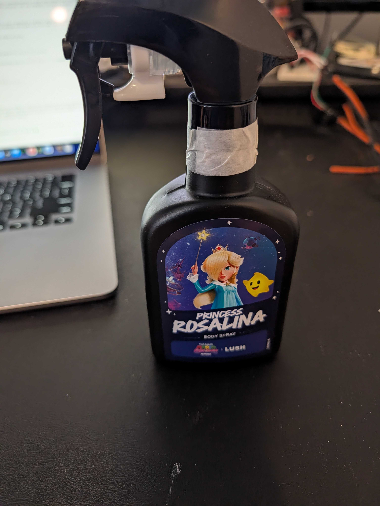

   ギフト箱がマリオはてなブロックなので、香りもマリオ繋がりに。
   スプレータイプなので粉に直接吹き付けるだけで均一に香り付けできて便利でした。

---

### 制作手順（写真付き）

#### フェーズ A: 4 色の粉末準備

上記レシピを 4 つのボウルに分けて、それぞれ食用色素で **赤・緑・青・黄** に着色。
水とアルコール（or 香りスプレー）で湿度調整。

| | |
|---|---|
| 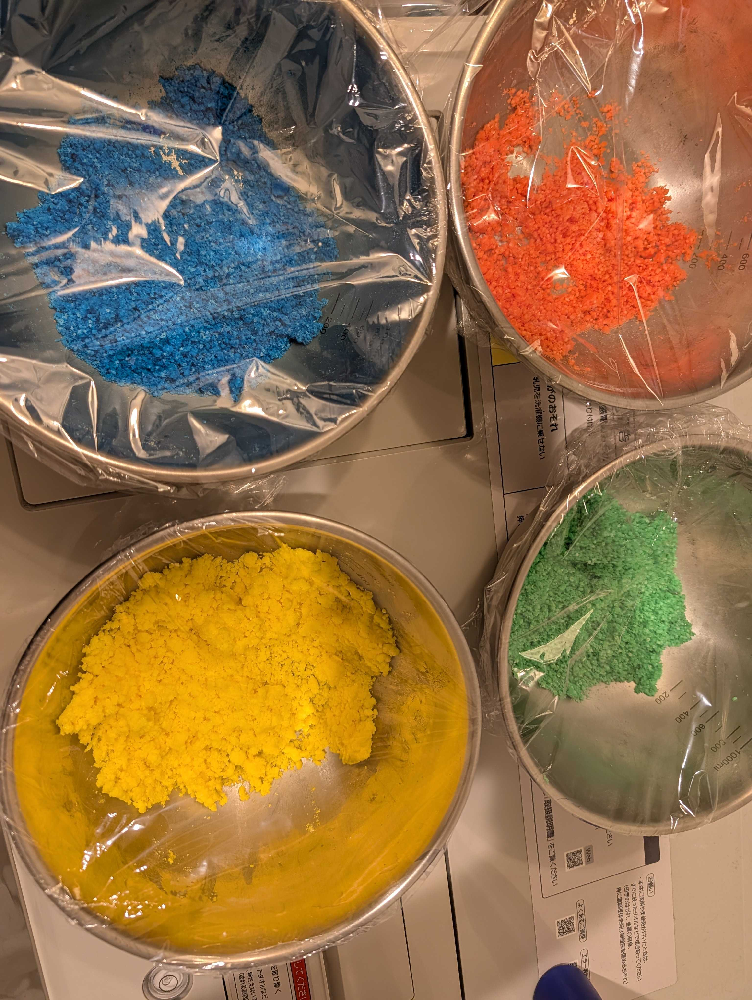 | 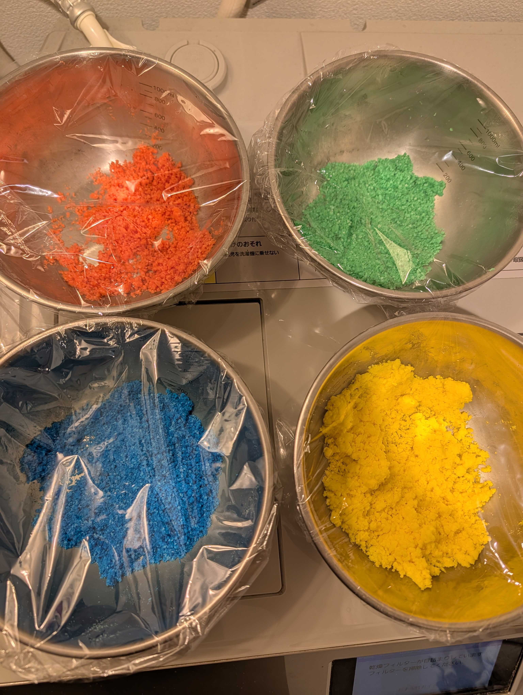 |

🎥 **混ぜている様子の動画 (YouTube Shorts)**: <https://www.youtube.com/shorts/3kC7oP4pvtE>

ラップでボウルをカバーして粉の飛散と乾燥を防止。

#### フェーズ B: 型詰め・乾燥

左右分割した型の片方に粉を山盛りに詰め、もう片方をかぶせてぐっと押し付けて圧縮。
ゴムバンドで圧着して半日〜1 日乾燥。

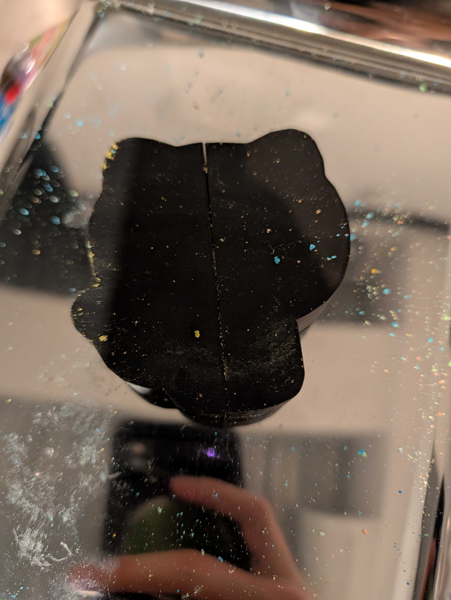

#### フェーズ C: 離型 ⚠️ ここが一番繊細

乾燥後、ゴムバンドを外す。**ここからが Octocat 形状で一番デリケートな工程。**
「軽く叩けば外れる」みたいな単純な話ではないので、以下を守ってください。

##### 🚨 やってはいけないこと
- いきなり型を上下に引き剥がす → 耳・腕・触手が **ほぼ確実に折れます**
- 型を横方向にスライドさせる → 同じく崩壊します

##### ✅ 正しい「片面だけ」外し方
1. 型を背面（フラット側）にして机に置く
2. **腕がついている側の型半分を手でしっかり固定**
3. もう片方の型半分を **真上にゆっくり持ち上げる**
4. 顔と腕のあいだにある隙間を崩さないように沿わせるのがコツ

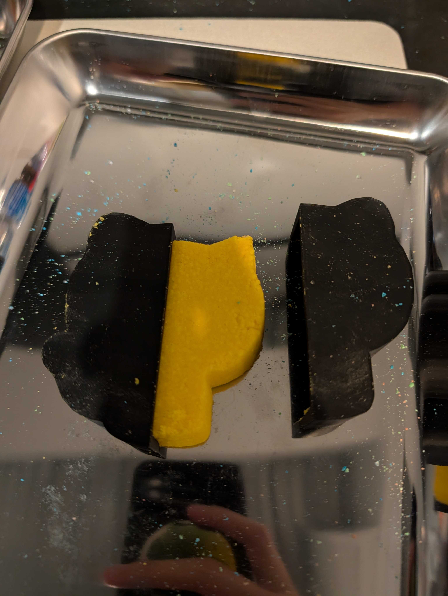

うまく外れた成功例 ↓

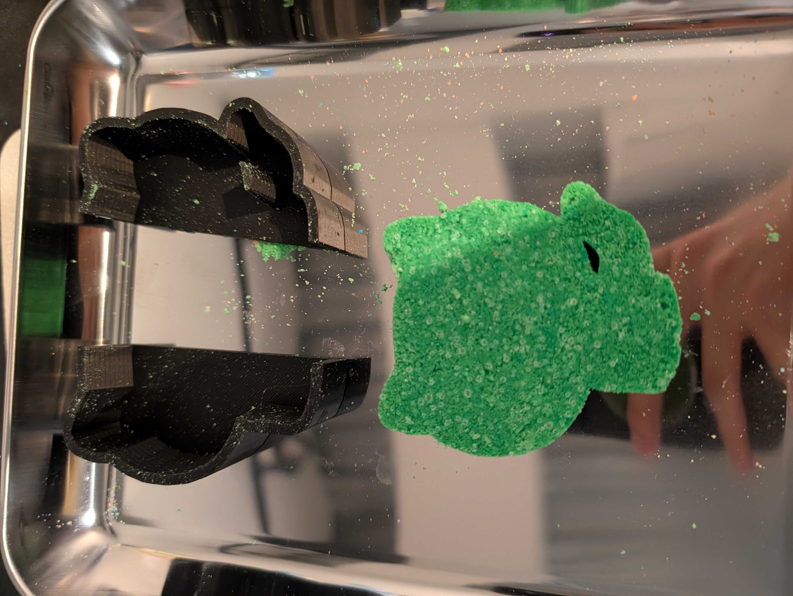

##### 💡 そもそも完全に外さないという選択肢（個人的おすすめ）

片方を外せても、**もう片方の型を外すのが特に難しい**です。私は今回成功し
ましたが、人によっては高確率で崩れますし、誰かに渡すときに崩壊するのも
怖い。なので **「片方の型をつけたままお風呂に投入する」運用を強く推奨**
します。

これで問題ない理由:
- バスボムの表面のうち **半分以上は外気に露出している** ので、
  発泡反応に必要な水との接触面積は十二分にある（フェーズ F で実証済）
- 崩壊リスクがゼロ
- ギフトとして渡す場合、配送・手渡し時の破損も気にしなくていい
- **見た目もむしろこっちの方がカッコイイ**（次項）

##### 🎨 「型ごと」の方が見栄えが良い理由 — *Dragon Shading* との類似

型のフチが Octocat の輪郭をくっきり縁取って見えるため、いわゆる
**ドラゴンシェーディング**（セル／トゥーンシェーディングで強い黒輪郭線
を描く 3D アニメ表現の技法）と近い視覚効果が生まれます。

代表的な比較例:
- 『ドラゴンボール Z』(PS2) — 普通の 3D シェーディング
- 『ドラゴンボール Z2』(PS2) — キャラクターに **黒い輪郭線** が追加され、
  アニメ調・劇画調が一気に強まった

→ 今回のギフトは
**(a)** 贈呈時の崩壊リスクをゼロにする
**(b)** Octocat の輪郭がくっきり見えて見映えが良い
…という二重のメリットから、**あえて 4 個すべて型をつけたまま箱詰め**
しました。

#### フェーズ D: 保存・梱包

完成したバスボムは Ziploc に入れて湿気から保護。

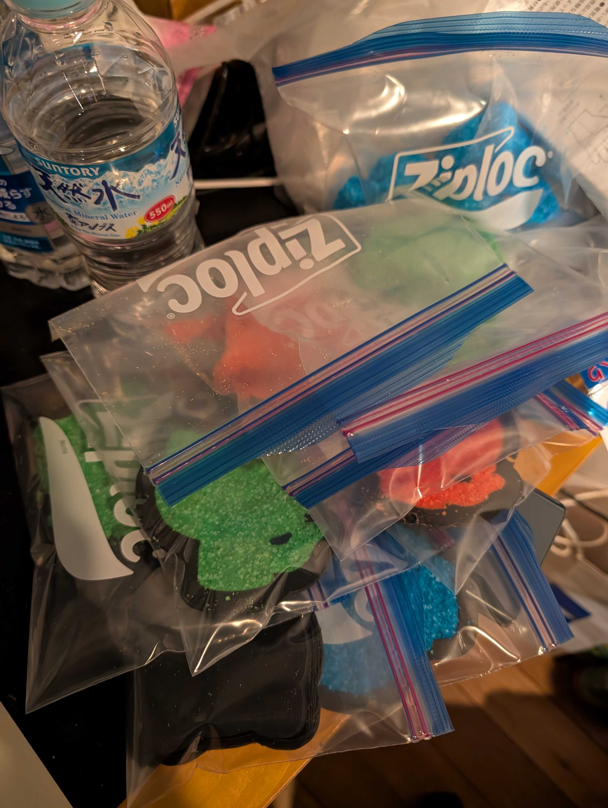

緩衝材入りの白箱に 1 個ずつ、または 4 色セットで梱包（実際の贈呈は型ごと）。

| 1 個梱包 | 4 色セット |
|---|---|
| 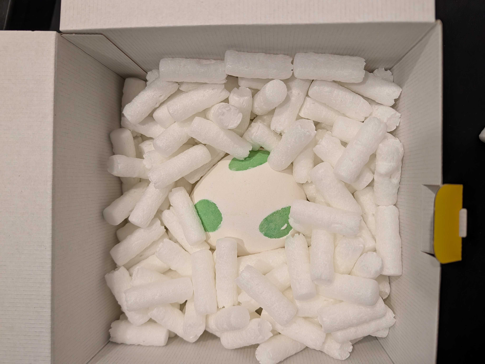 | 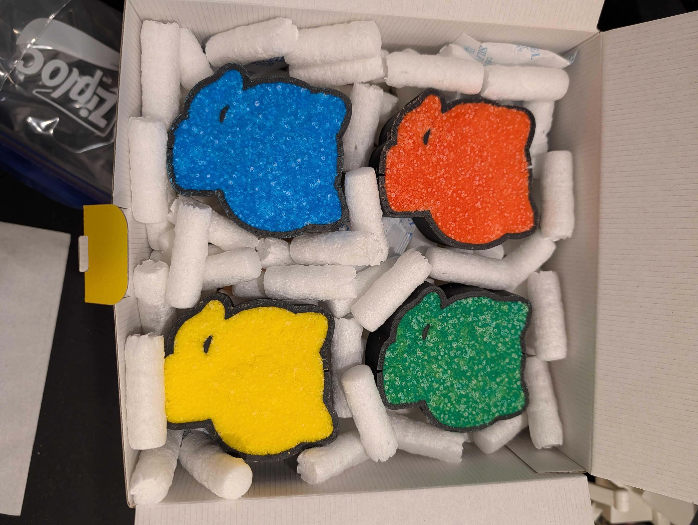 |

#### フェーズ E: ギフトラッピング 🎁

3D プリント製の **マリオはてなブロック箱** に詰めて、ふたに Octocat ステッカーを貼って完成。

| ブロック箱（前） | フタを閉じて完成 |
|---|---|
| 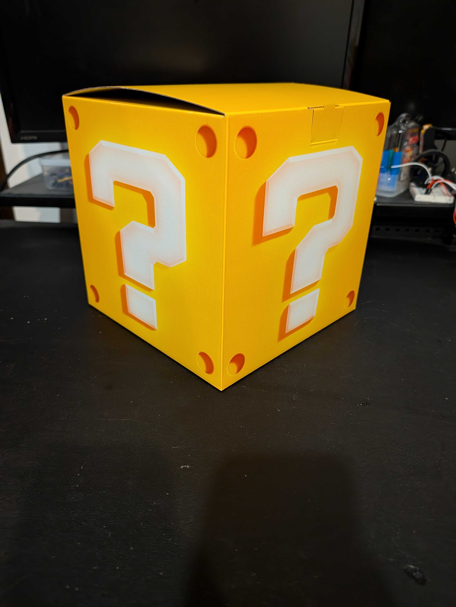 | 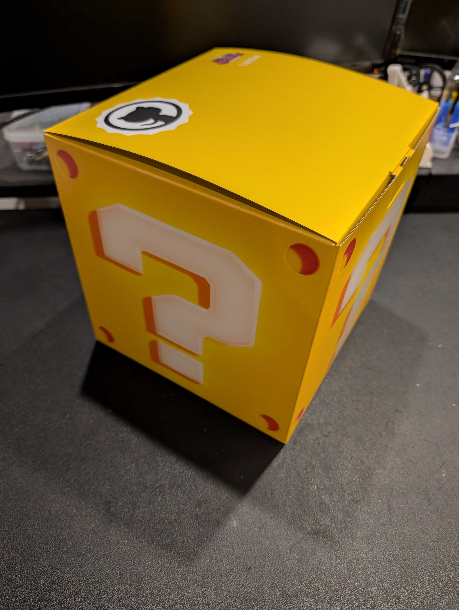 |

#### フェーズ F: 機能テスト（実際にお湯に入れてみる）✅

形が崩れてしまったバスボム（離型ミスのプロトタイプ）を実際にお風呂に投入し、
**ちゃんとシュワシュワ反応するか** を検証。

🎥 **検証動画 (YouTube Shorts)**: <https://www.youtube.com/shorts/VPH1sM8e9gE>

結果: **見た目が崩れていても化学反応は問題なく機能** ✨
重曹 + クエン酸 + 水 → 二酸化炭素の発泡反応はバスボムの形状とは無関係なので、
配送や手渡しで多少崩れても入浴剤としての性能には影響なし、ということが確認できました。

---

### Trial 01 → Trial 02 の変化

| 項目 | trial-01 | trial-02 | 結果 |
|---|---|---|---|
| 型 STL | `mold_cat_container.stl`（v1） | 同じ `mold_cat_container.stl` を使用 | — |
| 印刷方法 | そのまま 1 ピース印刷 | **Bambu Studio で左右 2 分割してから印刷** | ✅ パカッと外せる |
| 抜き勾配 | 5° | 5°（型は同じ） | ✅ 左右分割で 5° でも実用可 |
| ラップ | 直接詰め | 直接詰め（同じ） | — |
| 取り出し方 | 「外れない…」 | パカッ → 取り出せた | ✅ 離型成功（ただし脆さ問題で型ごと贈呈） |
| 配色 | 単色（赤） | 4 色（赤・緑・青・黄） | ✅ Microsoft ロゴ表現 |
| 香り | なし | ラベンダー / グレープ（ロゼッタ） | ✅ ギフト性 UP |

---

### 学び・気づき

- **スライサーのカット機能は強力**: 既存 STL を再設計せずに「クラムシェル化」可能
- **5° 勾配でも分割さえすれば離型可能** — v1 の失敗の主因は「床密閉」、勾配の浅さは二次要因だった
- **複数色の粉を別々に作る** ことで 1 セットで色違いの作品が作れる（Microsoft ロゴカラーや好きなテーマカラーで！）
- **乾燥は焦らない**：圧縮直後すぐ開けると崩れるリスク。ゴムバンドで半日以上クランプ推奨
- **細部のあるシルエットは脆い**：Octocat の耳や触手のような細い部分は離型できても、配送・手渡しの振動で欠けやすい。ギフト用は **「型に詰めたまま渡す」のが安全**（型もギフトの一部に！）
- **香り付けはスプレーが楽**: 既製のボディースプレーを使えば均一・お手軽
- **保険は大事**: 自作の出来に自信が無ければ市販品も同梱するのは賢いリスクヘッジ

---

### 参考文献

- 📖 篠原由子『バスボムレシピ — カラフル！シュワシュワ！身近な材料で色も香りも自分だけのオリジナル』河出書房新社, 2015. ISBN 978-4309285597 — [Amazon](https://www.amazon.co.jp/dp/4309285597) / [版元ドットコム](https://www.hanmoto.com/bd/isbn/9784309285597)
  - 100 円ショップで揃う材料でカラフルなバスボムを作るレシピ集。今回の配合の出発点として参照。
- 🛠️ [Bambu Studio](https://bambulab.com/ja/download/studio) — STL を左右分割するために使用したスライサー

---

<a id="english"></a>
## English

Second trial — **four-color Octocat bath bombs!** 🐱✨

This trial built on the lessons from [Trial 01 (failure)](../2026-05-04-trial-01/), but the
**actual fix was different from what we'd designed** (see "Mold used" below).

> 📌 **Caveat**: Although demolding worked, the thin **ears and tentacles** of the Octocat
> shape turned out to be fragile and tended to crumble during handling. So for the actual
> gift we **left the bath bombs inside their molds** — the recipient simply opens the
> mold and drops the bath bomb directly into the bath. As a bonus, the 3D-printed mold
> becomes part of the gift 🎁

---

### Backstory 🎁

These bath bombs were made as a farewell gift for **a colleague leaving GitHub
(formerly at Microsoft)**. To honor both employers, four Octocats were cast in the
**Microsoft logo colors (red, green, blue, yellow)** and packed into a 3D-printed
**Mario question-block** gift box.

> 💡 As insurance against a possible failure of the homemade bath bombs,
> a Lush "Yoshi's Egg" bath bomb and a foam bath bomb were included as backups.
> The homemade ones turned out great — so both went into the gift.

---

### Mold Used — design vs. reality

This repo contains **two** mold STLs:

| Mold | Files | Status |
|---|---|---|
| v1: single-sided container | [`mold_cat_container.stl`](../../mold_cat_container.stl) | failed in trial-01 |
| v2: auto-generated clamshell (top/bottom split) | [`mold_cat_clamshell_A.stl`](../../mold_cat_clamshell_A.stl) / [`mold_cat_clamshell_B.stl`](../../mold_cat_clamshell_B.stl) | not yet printed at trial-02 time |

For trial-02 the redesigned v2 clamshell wasn't printed yet, so we used a **workaround**:
take the v1 container STL and **split it left/right in [Bambu Studio](https://bambulab.com/en/download/studio)'s slicer** before printing.

```
v1 model            Split L/R in Bambu Studio
   _______               ___    ___
  |       |             |   |  |   |
  |   🐱   |    →        | 🐱 || 🐱 |   (mirrored left + right pieces)
  |_______|             |___||___|
   ↑                     ↑
   sealed floor          opens at parting plane
```

So "clamshell-ification" was achieved via the **slicer's cut function** instead of a redesign.
The auto-generated v2 clamshell mold remains a future task to validate.

---

### Recipe used

| Ingredient | Amount |
|------|------|
| Baking soda | 70g |
| Citric acid | 30g |
| Coarse salt | 20g |
| Cornstarch | 10g |
| Purified water | ≈15mL |

Mix and add water gradually until the powder **clumps when squeezed but crumbles when poked**.
Make 4 separate batches (red, green, blue, yellow).

> 📚 **Recipe reference**: Yuko Shinohara, *Bath Bomb Recipes — Colorful & Fizzy:
> Make Your Own Originals from Common Ingredients* (バスボムレシピ),
> Kawade Shobo Shinsha, 2015. ISBN 978-4309285597 (Japanese only) —
> [Amazon (Japan)](https://www.amazon.co.jp/dp/4309285597)

---

### Fragrance variations

We tried two scenting approaches:

1. **Plant-based oil + lavender essential oil** — classic aromatherapy approach
2. **"Princess ROSALINA" body spray (Mario Movie × LUSH collab)** — grape scent

   

   Since the gift box was a Mario question block, we matched the fragrance to the
   theme. The spray format made it easy to evenly scent the powder.

---

### Process (with photos)

#### Phase A — Mix four colors of powder

Split the recipe into four bowls and tint each with food coloring
(**red, green, blue, yellow**). Adjust hydration with water and the optional
fragrance spray.

| | |
|---|---|
|  |  |

🎥 **Video of the mixing (YouTube Shorts)**: <https://www.youtube.com/shorts/3kC7oP4pvtE>

Plastic wrap kept the bowls dust-free and dry until packing.

#### Phase B — Pack the mold

Heap each color into one half of the slicer-split mold, press the other half down firmly,
clamp with rubber bands, and leave to cure for half a day to a full day.


#### Phase C — Release ⚠️ The most delicate step

After curing, remove the rubber bands. **This is the most fragile step
when the bath bomb is shaped like an Octocat** — it's not just "tap and
pop", so please follow the rules below.

##### 🚨 What NOT to do
- Pull the two halves apart abruptly → ears, arms and tentacles will
  **almost certainly snap off**
- Slide the mold halves sideways → same result, total collapse

##### ✅ Correct way to release one half
1. Lay the mold flat on its back (flat side down)
2. **Hold the half containing the arms firmly in place** with one hand
3. **Lift the other half straight up, slowly**, keeping it perfectly vertical
4. The trick is to follow the natural gap between the face and the arms
   without disturbing it


A successful release looks like this ↓


##### 💡 Or just don't fully demold (my personal recommendation)

Even after one half comes off, removing **the second half is genuinely
hard**. I succeeded this time, but many people will crumble it; and even
if you succeed, it could still break in transit when handing it to
someone. So I strongly recommend **leaving one mold half attached and
dropping the whole thing into the bath as-is**.

Why this is fine:
- More than half of the bath bomb's surface is already exposed to air,
  so the contact area with bath water is more than sufficient for a
  proper fizz reaction (verified in Phase F below)
- Zero crumbling risk
- Zero damage risk during gift transit / handover
- **It actually looks cooler this way too** (next note)

##### 🎨 Why the "in-mold" look is more visually appealing — *Dragon Shading* analogy

The edge of the mold traces a clean outline around the Octocat
silhouette, producing the same kind of visual effect as the
**"Dragon shading"** technique — i.e. cel/toon shading with bold black
outlines drawn on top of an otherwise 3D character.

Reference comparison:
- *Dragon Ball Z* (PS2) — standard 3D shading
- *Dragon Ball Z2* (PS2) — characters now have **bold black outlines**,
  making them look much more anime-/comic-styled

→ For this gift, leaving the mold attached gave us
**(a)** zero crumbling risk in transit, and
**(b)** a sharper, more iconic Octocat silhouette
…so all four bath bombs were boxed up still snugly inside their molds.

#### Phase D — Store & pack

Each bath bomb went into a Ziploc bag to protect against humidity.


Either packed individually or as a 4-color set in a white box with peanut packing
(though the actual gift kept the bath bombs inside their molds).

| Single | Set of four |
|---|---|
|  |  |

#### Phase E — Gift wrapping 🎁

The set was placed inside a 3D-printed **Mario question-block box** with an
Octocat sticker on the lid.

| Block (front view) | Final lid closed |
|---|---|
|  |  |

#### Phase F — Functional test (drop one in the bath) ✅

We dropped a misshapen prototype (a demolding failure) into actual bath water to check
whether **the fizz reaction still worked** despite the broken shape.

🎥 **Test video (YouTube Shorts)**: <https://www.youtube.com/shorts/VPH1sM8e9gE>

Result: **the chemistry works fine even when the bath bomb is cosmetically broken** ✨
Baking soda + citric acid + water → CO₂ fizz is independent of the bath bomb's shape,
so even if a bath bomb crumbles in transit it will still perform its intended function
in the tub.

---

### Trial 01 → Trial 02 differences

| Item | Trial 01 | Trial 02 | Result |
|---|---|---|---|
| Mold STL | `mold_cat_container.stl` (v1) | Same `mold_cat_container.stl` | — |
| Print method | Whole, single piece | **Sliced L/R in Bambu Studio first** | ✅ Opens cleanly |
| Draft angle | 5° | 5° (same mold) | ✅ 5° is OK once split |
| Liner | None | None (same) | — |
| Removal | "Won't come out…" | Pop → Out | ✅ Demolds OK (gifted in-mold due to fragility) |
| Colors | Single (red) | Four (red, green, blue, yellow) | ✅ Microsoft logo theme |
| Scent | None | Lavender / grape (Rosalina spray) | ✅ Better gift |

---

### Lessons Learned

- **Slicer cut functions are powerful**: You can "clamshell-ify" any solid mold STL
  in your slicer without redesigning the model.
- **5° draft is workable as long as you can split the mold** — trial-01's main failure
  was the *sealed floor*, not the shallow draft.
- **Mix multiple colors separately** to make a multi-color set in a single mold —
  great for themed gifts.
- **Don't rush the cure.** Opening too soon risks crumbling. Half a day under rubber-band clamp is the minimum.
- **Detailed silhouettes are fragile.** Thin features like Octocat ears and tentacles
  release from the mold OK but tend to chip during transit and handling. For gifts,
  **leaving the bath bomb inside the mold is safer** (the mold becomes part of the gift).
- **Pre-made body sprays make scenting easy.** No need to fuss with essential oils.
- **Insurance pays.** Including a commercial bath bomb as backup is a smart hedge for first-time gifts.

---

### References

- 📖 Yuko Shinohara, *バスボムレシピ — カラフル！シュワシュワ！身近な材料で色も香りも自分だけのオリジナル*
  (Bath Bomb Recipes — Colorful & Fizzy), Kawade Shobo Shinsha, 2015.
  ISBN 978-4309285597 (Japanese only) —
  [Amazon (Japan)](https://www.amazon.co.jp/dp/4309285597) /
  [Hanmoto.com](https://www.hanmoto.com/bd/isbn/9784309285597)
  - The starting point for our recipe ratios.
- 🛠️ [Bambu Studio](https://bambulab.com/en/download/studio) — slicer used for the L/R split print
